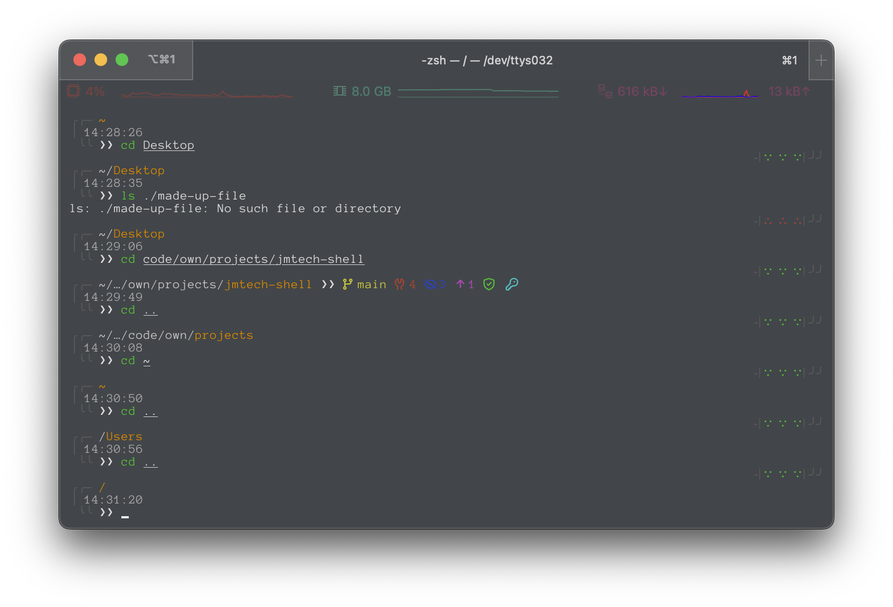
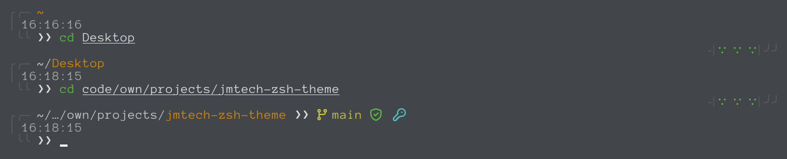
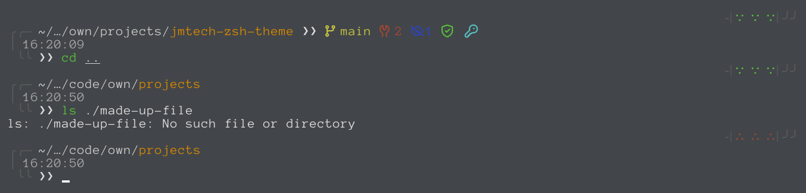

# JMTech Zsh Theme

A multi-line zsh theme with Git integration and command status indicators.

## Features

- Multi-line prompt with clean, modern aesthetics
- Path truncation
- Comprehensive Git status information:
  - Branch name
  - Staged, unstaged, and untracked changes
  - Stash count
  - Ahead/behind status
  - GPG signing information
- Command execution status with visual indicators
- Timestamp reflects when each command is executed
- Cached Git operations for better performance
- Customizable colors and symbols

## Preview





## Requirements

- Zsh
- Oh My Zsh framework
- A [Nerd Font](https://www.nerdfonts.com/) for Git status icons (recommended)

## Installation

### Using Oh My Zsh

1. Clone the repository into Oh My Zsh custom themes directory:
```bash
git clone https://github.com/jmaaltech/jmtech-zsh-theme.git ${ZSH_CUSTOM:-$HOME/.oh-my-zsh/custom}/themes/jmtech
```

2. Set up theme files:
```bash
ln -sf ${ZSH_CUSTOM:-$HOME/.oh-my-zsh/custom}/themes/jmtech/src/jmtech.zsh-theme ${ZSH_CUSTOM:-$HOME/.oh-my-zsh/custom}/themes/
```

3. Add to your ~/.zshrc:
```bash
ZSH_THEME="jmtech"
```

### Manual Installation

1. Clone the repository to your preferred location:
```bash
git clone https://github.com/jmaaltech/jmtech-zsh-theme.git ~/.local/share/zsh/jmtech
cd ~/.local/share/zsh/jmtech
```

2. Install the theme:
```bash
./scripts/install.sh
```

## Post-Installation

**Optional**: For terminals without Nerd Fonts, add this to your ~/.zshrc before the theme setting:
```bash
export JMTECH_USE_NERD_FONTS="false"
```

Then, reload your configuration:
```bash
source ~/.zshrc
```

## Customization

You can customize the theme by modifying the following files:

- `lib/config.zsh`: Colors, symbols, and general settings.
- `lib/path.zsh`: Path display preferences.
- `lib/git.zsh`: Git integration.

## License

This project is licensed under the MIT License - see the [LICENSE](LICENSE) file for details.

## Credits

Created by jmaaltech.